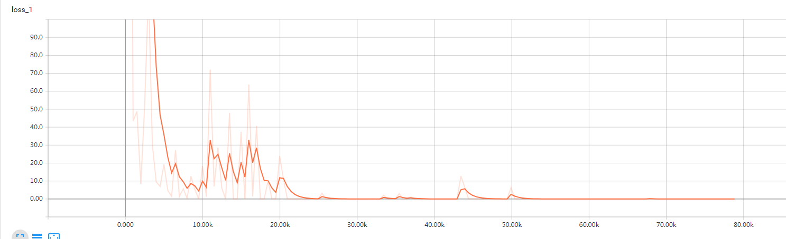

# NER-BERT（ROBERT）-TENSOR-SERVING
基于Bert（或Robert）预训练模型微调命名实体识别任务，并提供基于docker的Tensor Serving部署模型方案实现过程。  
## 修改记录
* 2020-03-09 创建项目

## 数据介绍
### 1. 数据
人名日报标注语料，具体格式见data目录中txt文件。
### 2. 类别
训练数据使用 BIO 标注方式，总共分为3种实体（person_name-人名、org_name-机构名、location-地名、other-其他）
  
对应的标签：  

    person_name:   B-PER   I-PER  
    org_name:      B-ORG   I-ORG  
    location:      B-LOC   I-LOC    
    other:         O
    
    以及 [CLS] [SEP] X 标签
可在 information.yaml 配置文件中查看。
## 训练
### 1. 环境
* python 3.6+
* tensorflow 1.9.0+
### 2. 项目结构
```
bert_ner
|________bert                                                # 官方bert代码
|________chinese_L-12_H-768_A-12或roberta_zh_l12：
|________checkpoint                                          # 模型固化
|________data                                                # 数据集
|________model                                               # 模型固化PB格式，用于tensor serving部署
|________run_ner.py                                          # 模型运行程序
|________information.yaml                                    # 配置文件
|________infer.py                                            # 预测程序
|________utils_.py                                           # 预测阶段文本处理程序
```
### 3. 预训练模型
下载以下任意预训练模型放入项目中。（注意：修改预训练模型路径）
* [Google BERT 中文预训练模型 chinese_L-12_H-768_A-12](https://storage.googleapis.com/bert_models/2018_11_03/chinese_L-12_H-768_A-12.zip). 
* [RoBERT 中文预训练模型 roberta_zh_l12](https://pan.baidu.com/s/1hAs7-VSn5HZWxBHQMHKkrg)
### 4. 参数介绍
* **data_dir**: 输入样本的文件夹，详细格式如：~/data/train.txt
* **bert_config_file**: bert模型配置json文件，详细格式如：~/chinese_L-12_H-768_A-12/bert_config.json
* **task_name**: 任务名称，用于选择processor
* **output_dir**: 结果输出文件夹
* **init_checkpoint**: checkpoint文件夹，指训练好的模型，这里为~/chinese_L-12_H-768_A-12
* **do_lower_case**: 是否对输入数据进行小写转换
* **max_seq_length**: 每个输入样本的最大训序列长度
* **do_train**: 是否进行训练
* **do_eval**: 是否进行验证
* **do_predict**: 是否进行预测
* **train_batch_size**: 训练样本的批次大小
* **eval_batch_size**: 验证样本的批次大小
* **predict_batch_size**: 测试样本的批次大小
* **learning_rate**: 学习率
* **num_train_epochs**: 重复训练多少次
* **warmup_proportion**: 用于做学习率衰减
* **save_checkpoints_steps**: 多少步存储一次模型
* **iterations_per_loop**: 每次estimtor中执行多少步
* **vocab_file**: 字典文件，例如~/chinese_L-12_H-768_A-12/vocab.txt

### 5. 运行
不建议使用命令行解析方式修改超参数，在调参过程中需要频繁修改超参数，在文件中修改既方便，也不会出错。
```
python3 run_ner.py
```
基于Bert训练loss效果如下：

### 6. 评估
### 7. 模型固化
模型最终会保存到checkpoint和model中，两个模型文件格式区别如下：  
* checkpoint：当do_train设置为True时，estimator会运行save_checkpoints_steps保存一次，主要用于训练  
* model：当do_predict设置为True时，模型参数会保存为PB格式，建议当模型收敛后在设置为True运行一次，主要用于tensor serving部署  
训练好的模型在 [百度网盘](https://pan.baidu.com/s/1HUWJ4EdSrp00sq4jPhp-2g) 提取码：gzot 
## 部署
基于docker部署的tensor serving是十分简便的，只需要简单几步就能启动模型服务。
### 1. 环境
* docker
* 镜像 tensorflow/serving 1.9.0-devel-gpu
### 2. 步骤
（1）生成容器，注意挂载目录（我个人一般会挂载代码、数据、模型三个目录），数据和代码尽量不要放到容器当中  
（2）进入容器，命令：docker exec -it --user root [容器id] /bin/bash  
（3）在容器中执行命令：tensorflow_model_server --name=modelserving --port=8500 --rest_api_port=8501 --model_name=<模型的名称> --model_base_path=<模型存储的位置，即model文件中的模型，不指定版本>  
（4）退出容器。（直接退出容器，模型服务是不会关闭的）
## 预测
本项目提供了预测代码，有两种模式可以选择，且理论上支持无限长文本识别。对句子分句，当句子超过设定的最大长度，会截断处理。
* gRPC服务：模型部署到tensor serving中，通过gRPC接口调用
* 本地加载：直接加载模型调用
## 相关参考
#### ner
https://github.com/kyzhouhzau/BERT-NER  
https://github.com/ProHiryu/bert-chinese-ner  
https://github.com/macanv/BERT-BiLSTM-CRF-NER  
#### bert
https://github.com/google-research/bert  
https://github.com/brightmart/roberta_zh  
